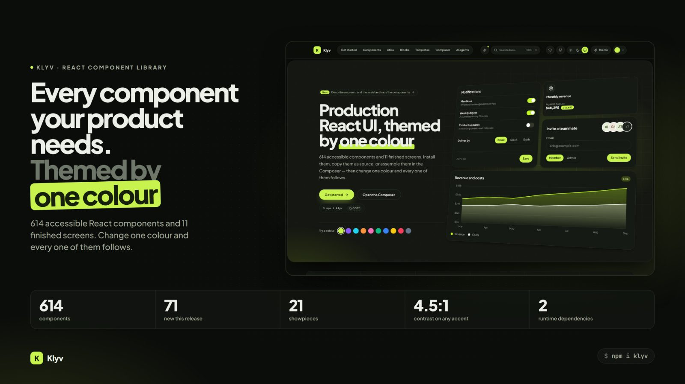
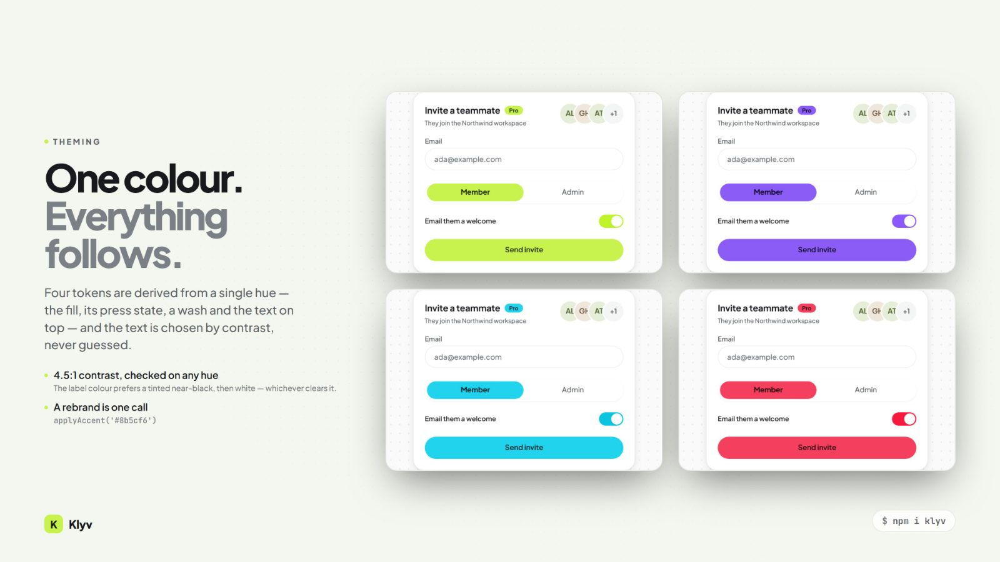
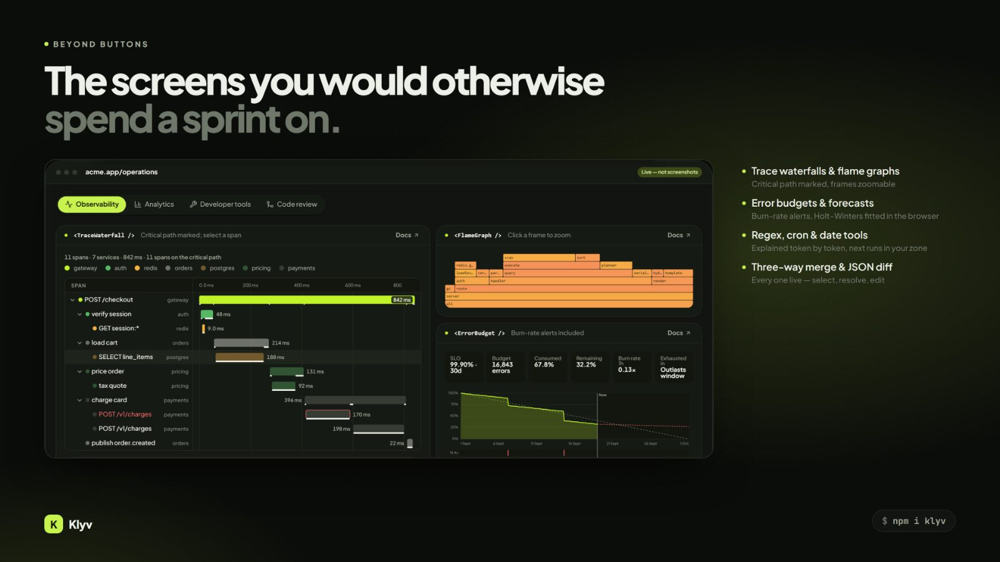

<p align="center">
  <a href="https://klyvui.xyz"></a>
</p>

<h1 align="center">Klyv</h1>

<p align="center">
  <strong>An accent-led React component library.</strong><br>
  614 accessible components and 11 finished screens. Change one colour and every one of them follows.
</p>

<p align="center">
  <a href="https://klyvui.xyz">Docs &amp; live previews</a> ·
  <a href="https://klyvui.xyz/components">Components</a> ·
  <a href="https://klyvui.xyz/composer">Composer</a> ·
  <a href="CONTRIBUTING.md">Contributing</a>
</p>

<p align="center">
  <a href="https://github.com/Klyv-UI/klyv/actions/workflows/ci.yml"></a>
  <a href="LICENSE"></a>
</p>

---

## Install

```bash
npm install klyv
```

```tsx
import { Button, DataTable, applyAccent } from 'klyv'
import 'klyv/styles.css'
```

That's the whole setup. `klyv/styles.css` is prebuilt, so **you don't need Tailwind**. If you already use Tailwind, import the preset instead so utilities aren't shipped twice:

```css
@import 'tailwindcss';
@import 'klyv/preset.css';
```

- **Small footprint:** ESM only, one module per component, `sideEffects` declared, so bundlers drop what you don't use.
- **Two runtime dependencies**, `clsx` and `tailwind-merge`. React 18.3 or 19 is a peer dependency.
- **Bring your own icons:** icons are a structural type, so Lucide, Phosphor or your own SVGs all work.
- **No charting library:** charts, audio and physics are drawn by hand with SVG, canvas and Web Audio.

## One colour themes everything



Nothing in the library hard-codes a colour. One call derives the accent, its press state, a soft wash and the text colour on top, and every component repaints without a rebuild.

```ts
import { applyAccent, applyTheme, applyMode } from 'klyv'

applyAccent('#8b5cf6')   // text on the accent always clears 4.5:1 contrast

applyTheme({
  accent: '#8b5cf6',
  base: 'slate',         // the neutrals, in light and dark
  radius: 'lg',
  font: 'inter',
  style: 'elevated',     // soft | flat | outline | elevated
})

applyMode('dark')        // 'light' | 'dark' | 'system'
```

Themes can be saved and restored before first paint, scoped to one section with `<ThemeScope>`, or exported as plain CSS with `themeToCss()`. Try it on the [Themes page](https://klyvui.xyz/themes).

## What's inside



614 components in thirteen groups, from the basics to the screens you would otherwise spend a sprint on:

| | |
| --- | --- |
| **Foundations, Layout, Navigation** | type scale, stacks, shells, tabs, menus, search |
| **Actions, Forms & Inputs** | buttons, dates, rich text, schema forms, code editor |
| **Data Display, Charts** | tables, pivots, trace waterfalls, flame graphs, forecasts |
| **Feedback, Overlays** | toasts, dialogs, empty states, onboarding |
| **Motion, Interaction, Canvas & Play** | drag and drop, whiteboards, WebGL fluid, games |
| **SaaS** | pricing, auth, billing, teams, settings, API keys, webhooks |

Plus **11 blocks**, finished screens such as a dashboard, an admin panel and a SaaS landing page. There are also **21 showpieces**, components like `FluidCanvas`, `ClothPanel` and `EventHorizon` that exist to be seen. Browse them all at [klyvui.xyz/components](https://klyvui.xyz/components).

## Copy the source instead

Prefer to own the code? The CLI copies a component with everything it depends on into your project:

```bash
npx klyv add data-table      # the component and its dependencies
npx klyv add block dashboard # a whole screen
npx klyv list drag           # search by name, group or description
npx klyv info combobox       # see what it would bring with it
```

Imports are relative and folders are flat, so the copied files work without rewriting any imports. Add `--dry` to preview the files, or `--dest <dir>` to choose where they go.

## Built to a standard

- **Accessible:** every component page, block and screen is rendered and audited with axe on every pull request, and keyboard paths are tested with real key presses.
- **Light and dark:** one set of tokens with two sets of values, so no component has a dark variant.
- **Server Components:** `'use client'` is added only where it is needed, derived from the code and checked by the build.
- **Enforced rules:** the build fails on hard-coded colours, hard-coded radii, or animation that ignores reduced motion.
- **Evidence, not claims:** each docs page shows only the capabilities there is generated evidence for.

## For AI agents

An MCP server ships with the package, so coding agents can search components, read props and source, and fetch blocks and tokens:

```bash
claude mcp add klyv -- npx -y klyv mcp
```

There's also an Agent Skill in [`skills/klyv`](skills/klyv/SKILL.md). See [`mcp/README.md`](mcp/README.md) or the [Agents page](https://klyvui.xyz/agents).

## Contributing

```bash
git clone https://github.com/Klyv-UI/klyv.git
cd klyv && npm install
npm run dev
```

| Command | |
| --- | --- |
| `npm run dev` | regenerate metadata, then start the docs site |
| `npm test` | preset, interaction, platform, axe and MCP suites |
| `npm run lint` | type-check |
| `npm run generate` | rebuild generated data (commit the result) |
| `npm run build:lib` | build the publishable package |

Every pull request runs CI, and each merge to `main` deploys [klyvui.xyz](https://klyvui.xyz). Read [CONTRIBUTING.md](CONTRIBUTING.md) for the house rules and what a pull request needs.

## License

[MIT](LICENSE)
